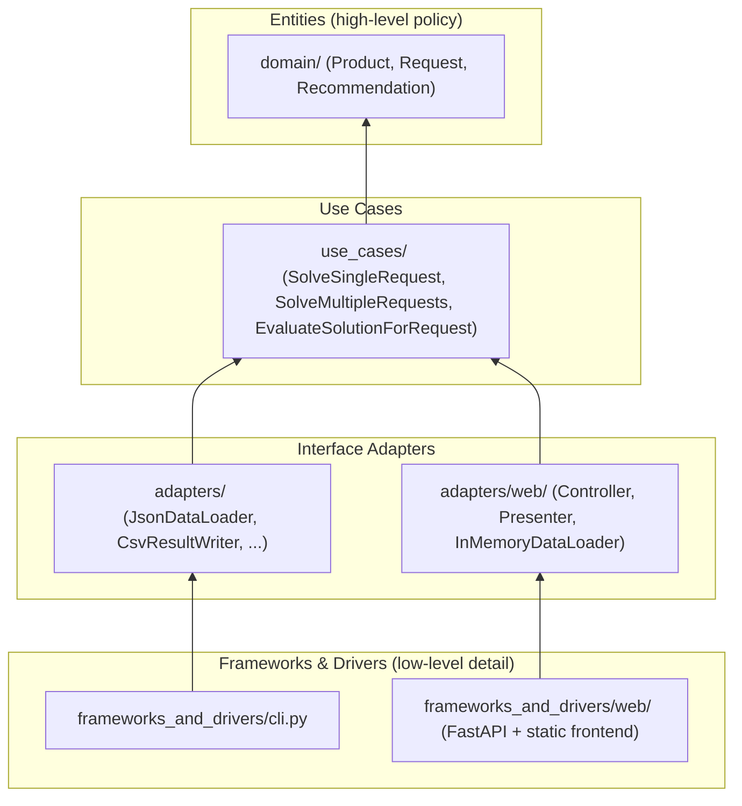

# SEFOP - Python Advanced: Decision-Support System as a Web Application

**Reference implementation of [SEFOP](https://github.com/sefop) for Python**

[](https://opensource.org/licenses/MIT)
[](https://www.python.org/)
[](https://github.com/sefop/sefop-python/actions/workflows/ci-unit-tests.yml)
[](https://github.com/sefop/sefop-python/actions/workflows/ci-integration-tests.yml)
[](https://github.com/sefop/sefop-python/actions/workflows/ci-docker-build.yml)

---

## Table of contents

- [Problem description](#problem-description)
- [Architecture](#architecture)
- [Installation](#installation)
- [Testing](#Testing)
- [Code quality](#code-quality)
- [Usage — CLI](#usage--cli)
- [Usage — Web app](#usage--web-app)

---

## Problem description

This repo solves a knapsack problem. Given a **budget** and a **weight limit**, pick the combination of products that **maximizes total calories**.

### Mathematical formulation

**Sets**
- $I$: set of candidate products, indexed by $i \in I$

**Parameters**
- $\text{price}_i$, $\text{weight}_i$, $\text{calories}_i$: unit price (USD), unit weight (kg), and nutritional value of product $i \in I$
- $B$: budget, in USD (`max_budget_usd`)
- $W$: weight limit, in kg (`max_weight_kg`)

**Decision variable**
- $x_i \in \mathbb{Z}_{\ge 0}$ for each $i \in I$: number of units of product $i$ selected

**Objective** — maximize total calories:

$$\max \sum_{i \in I} \text{calories}_i \cdot x_i$$

**Constraints**

$$\sum_{i \in I} \text{price}_i \cdot x_i \le B \qquad \text{(budget)}$$

$$\sum_{i \in I} \text{weight}_i \cdot x_i \le W \qquad \text{(weight limit)}$$

$$x_i \in \mathbb{Z} {\ge 0} \quad \forall i \in I \qquad \text{(non-negativity and integrality)}$$

Because $x_i$ has no upper bound, this is an **unbounded knapsack problem**: any number of units of a product may be chosen, which is why integrality must be enforced explicitly rather than relying on a 0/1 selection variable.

### Example — Data from [`data/2/data.json`](data/2/data.json)

| Product   | Price  | Weight  | Calories |
|-----------|--------|---------|----------|
| Apple     | $1.00  | 0.50 kg | 100      |
| Chocolate | $5.00  | 1.00 kg | 50       |

**Constraints:** budget $10.00 and weight limit 2.00 kg

**Optimal solution:**

| Product   | Units | Cost   | Weight  | Calories |
|-----------|-------|--------|---------|----------|
| Apple     | 4     | $4.00  | 2.00 kg | 400      |
| Chocolate | 0     | $0.00  | 0.00 kg | 0        |

| Total calories | Total cost / Budget | Total weight / Max weight |
|-----------------|----------------------|----------------------------|
| 400             | $4.00 / $10.00       | 2.00 kg / 2.00 kg          |

The solver picks 4 apples — chocolate costs 10× more per calorie, so it never appears in the optimal solution.

---

## Architecture

This project follows **[Clean Architecture](https://blog.cleancoder.com/uncle-bob/2012/08/13/the-clean-architecture.html)**'s four canonical rings —
Entities (`domain/`), Use Cases (`use_cases/`), Interface Adapters (`adapters/`), and Frameworks & Drivers
(`frameworks_and_drivers/`) — with full manual [Dependency Injection](https://www.geeksforgeeks.org/system-design/dependency-injectiondi-design-pattern/), and
a single composition root (`startup.py`) that wires everything together. Two independent delivery mechanisms
sit in the outermost ring: a CLI and a web app (FastAPI backend + a minimal static frontend), both calling
into the same `use_cases/` and `startup.py` underneath.

Uncle Bob's original diagram for the pattern:


*Diagram by Robert C. Martin ("Uncle Bob"), from [The Clean Architecture](https://blog.cleancoder.com/uncle-bob/2012/08/13/the-clean-architecture.html).*

And how those same four rings map onto this repo's actual folders. Arrows point inward — the
direction dependencies are allowed to point — and the diagram is laid out top-to-bottom by
policy level: the **high-level policy** (Entities, the innermost ring) is at the **top**, and
the **low-level detail** (Frameworks & Drivers, the outermost ring) is at the **bottom**,
mirroring Uncle Bob's point that source code dependencies should point from detail toward policy:



At the top level, the repo has three folders:

```
src/
tests/
data/
```

### `src/`

`src/`'s immediate contents are:

```
src/
├── startup.py                # config (Settings/WebSettings) + composition root — the
│                              # only place concrete adapters and use cases get constructed
├── domain/                    # pure entities — Product, Request, Recommendation
├── use_cases/                 # application rules (see below)
├── adapters/                  # I/O implementations (see below), including adapters/web/
└── frameworks_and_drivers/    # delivery mechanisms (see below): cli.py and web/
```

**`use_cases/`** in more detail:

```
use_cases/
├── ports/                          # abstract interfaces (ABCs) the use cases depend on
│   ├── base_data_loader.py
│   ├── base_result_writer.py       # also defines TIMESTAMP_FORMAT
│   ├── base_request_discovery.py
│   └── base_solution_loader.py
├── optimization_response.py        # result of the two "solve" use cases
├── evaluation_response.py          # result of the "evaluate" use case
├── use_case_solve_single_request.py         # solve one request
├── use_case_solve_multiple_requests.py      # solve every request in a folder
├── use_case_evaluate_solution_for_request.py # feasibility-check a candidate solution
└── solving/                        # internal implementation detail of the
    │                                # solve use cases — not a top-level layer
    ├── orchestrator.py             # pipeline coordinator: pre → provider → post
    ├── preprocessing/              # filter infeasible products before solving
    ├── postprocessing/             # sort and refine the recommendation
    └── optimization/               # SolutionProvider + 4 implementations:
                                     # enumeration (brute force), MIP (HiGHS),
                                     # MIP (Google MathOpt/SCIP), heuristic
```

**`adapters/`** in more detail:

```
adapters/
├── json_data_loader.py
├── csv_result_writer.py
├── json_result_writer.py
├── directory_request_discovery.py
├── json_solution_loader.py
└── web/                       # adapters specific to the web delivery mechanism
    ├── in_memory_data_loader.py    # BaseDataLoader backed by memory, not a file —
    │                                # the HTTP request body already *is* the data
    ├── controller.py               # raw payload -> domain Request -> use case call
    └── presenter.py                # OptimizationResponse -> plain response data
```

Dependencies only point inward: `adapters/` imports from `use_cases/`, never the
reverse; `use_cases/solving/` internals (`SolutionProvider` and its three
implementations) are separate from the public ports in `use_cases/ports/` —
they are pluggable providers used only within the solving pipeline itself,
not something `adapters/` or `startup.py` implement directly (`startup.py`
only decides *which* MIP technology's `SolutionProvider` to construct).

**`frameworks_and_drivers/`** in more detail:

```
frameworks_and_drivers/
├── cli.py                     # argparse subparsers + dispatch only — no wiring
└── web/
    ├── main.py                # the FastAPI app instance (what Uvicorn points at)
    ├── routes.py               # POST /solve, GET /health — thin, no domain/use_cases imports
    ├── schemas.py               # Pydantic request/response models (input validation, OpenAPI docs)
    └── static/                  # the minimal frontend: index.html, style.css, app.js
```

This is the outermost ring: it's the only place that knows about argparse, FastAPI,
or Pydantic. Both delivery mechanisms are thin — they parse input, call into
`startup.py` to assemble what they need, and dispatch. Neither constructs a
concrete adapter or use case itself.

---

## Installation

### 1. Clone the repository
```bash
git clone https://github.com/sefop/sefop-python-starter.git
cd sefop-python-starter
```

### 2. Create a virtual environment using Python 3.12
```bash
py -3.12 -m venv .venv
.venv\Scripts\activate  # On Windows
# source .venv/bin/activate  # On macOS/Linux
```

### 3. Install dependencies and the package
```bash
pip install -r requirements.txt
pip install -e .
```

The `-e` flag installs the package in **editable mode**, making your source code directly importable. This is the standard Python development practice — no need to set `PYTHONPATH` or reinstall when you edit code.

**What breaks if you skip this step?** `pytest` still works, since `pyproject.toml` adds `src` to the path just for pytest. But `python -m frameworks_and_drivers.cli solve 1` will fail with an import error — `cli.py` imports `domain`, `use_cases`, etc. as top-level packages, and without the editable install Python has no way to find them under `src/` outside of pytest.

---

## Testing

### Run all tests
```bash
pytest
```

### Run unit tests only
```bash
pytest -m "not integration"
```

### Run integration tests only
```bash
pytest -m integration
```
Each integration test drives the real CLI end-to-end against a pre-built "situation" (`tests/resources/<situation>/`) and checks situation-specific conditions on the observable outcome only — e.g. the expected optimal calories, that an infeasible request exits non-zero and writes no solution, that tied optimal solutions still report the shared optimal total, or that a large instance correctly routes to the heuristic instead of the exact solvers. Formulation correctness (is the MIP model built right?) is checked separately and only at the unit level, by comparing `MipHighsSolutionProvider`'s output against `EnumerationSolutionProvider`'s brute-force ground truth — see `tests/use_cases/solving/optimization/test_providers_agree_with_enumeration.py` — not by diffing a generated `model.lp` against a golden file.

The web app has its own integration tests, `tests/frameworks_and_drivers/web/test_routes.py`, driving the real HTTP surface end-to-end via FastAPI's `TestClient` — no browser, no real network socket, but the same in-process request handling FastAPI uses in production. `tests/adapters/web/` covers the controller, presenter, and in-memory data loader as fast, non-integration unit tests.


---

## Code quality

CI runs two checks before the test suite; both are fast, so run them locally before pushing to avoid a red PR. These checks are not comprehensive, there are other 
code quality checks that are not executed here for simplicity (like a static code analysis tool as SonarQube).

### Format check (black)
```bash
black --check src tests   # verify formatting only, no changes written
black src tests           # reformat in place
```
Configuration (line length, target Python version) lives in `pyproject.toml`'s `[tool.black]` section, so the local command and CI always agree.

### Type check (mypy)
```bash
mypy
```
Configuration lives in `pyproject.toml`'s `[tool.mypy]` section.

---

## Usage — CLI

### Solve a single knapsack optimization request
```bash
python -m frameworks_and_drivers.cli solve 1  # solve request from data/1/data.json
python -m frameworks_and_drivers.cli solve 2  # solve request from data/2/data.json
python -m frameworks_and_drivers.cli solve 1 --format json  # write the result as JSON instead of CSV
```

### Solve every request in a folder
```bash
python -m frameworks_and_drivers.cli solve-batch data  # solve every request subfolder under data/
```

### Check whether a candidate solution is feasible for a request
```bash
python -m frameworks_and_drivers.cli evaluate 1 candidate_solution.json
```
where `candidate_solution.json` maps product name to candidate quantity:
```json
{ "apple": 4, "chocolate": 0 }
```

---

## Usage — Web app

The web app exposes the same `SolveSingleRequest` use case the CLI's `solve` command
uses, behind a single `POST /solve` endpoint and a minimal static frontend — a form to
configure a request (budget, weight limit, and a product table you can add/remove rows
to) and a Solve button. `solve-batch` and `evaluate` aren't exposed over HTTP; use the
CLI for those.

### Run via Docker
```bash
docker build -t sefop-web .
```
Reads the `Dockerfile` in the repo root and packages the app — Python,
dependencies, source code, and sample data — into a container image named
`sefop-web` (`-t` tags the image with that name). This step only needs to be
run once: it produces an image that's stored locally by Docker, and every
`docker run` afterwards reuses it without rebuilding. Re-run `docker build`
only when something it copies changes — `Dockerfile`, `requirements.txt`,
`pyproject.toml`, `src/`, or `data/` — so the image picks up the update.

```bash
docker run -p 8000:8000 sefop-web
```
Starts a new container from the `sefop-web` image and publishes it to your
machine: `-p 8000:8000` maps port 8000 on your host to port 8000 inside the
container, which is the port Uvicorn listens on (see the `CMD` line in the
`Dockerfile`). Unlike `build`, this command is meant to be run every time you
want to start the app — each run creates a fresh, independent container from
the same image.

Then open http://localhost:8000 and you will see the front-end of the project.